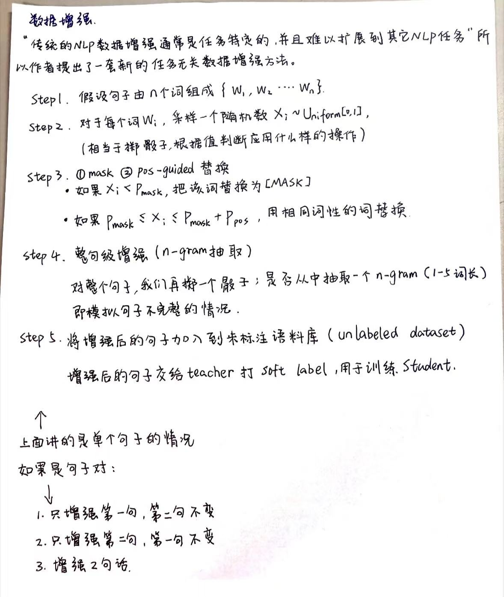

一）
9分类问题

标签 | 含义
B-PER | 人名开始（Beginning of a person entity）
I-PER | 人名内部（Inside a person entity）
B-LOC | 地名开始
I-LOC | 地名内部
B-ORG | 组织名开始
I-ORG | 组织名内部
B-MISC | 其他实体开始
I-MISC | 其他实体内部
O | 非实体（Outside）


测试集里面是有标注的（NER标签也给出），因为这是用于**离线评估**的，不是现实部署测试。
二）
我们将数据集中的数据转为`input_ids`,`attention_mask`,`labels`;
- 在此之前一定是已经完成了label2id的操作；
- 对于`labels`中的数，要么是标签所对应的id，要么是-100(也就是填充的内容)；
- 对于每个sentence的`input_ids`,`attention_mask`,`labels`，len()都是max_len

三）相关工作

尝试了两种学生模型：学生模型2和学生模型3
- ①学生模型1: 自定义6层bert模型；使用`transformer`中的`BertConfig`去修改`BERT`模型的层数、隐藏层维度等超参数【十分不建议】
- ②学生模型2: 学生模型截取老师模型的前几层
```python
from transformers import BertModel

# 加载完整的预训练模型
teacher_model = BertModel.from_pretrained("bert-base-uncased")

# 拷贝前6层
from transformers import BertConfig, BertModel

# 复制 config 并修改层数
config = teacher_model.config
config.num_hidden_layers = 6

# 新建学生模型
student_model = BertModel(config)

# 拷贝前6层 encoder 参数
student_model.embeddings.load_state_dict(teacher_model.embeddings.state_dict())
student_model.encoder.layer[:6] = teacher_model.encoder.layer[:6]
```

- ③学生模型3:教师模型用参数量大的预训练模型如`Bert-Large`,学生模型用参数量小的预训练模型如`DistilBERT` 

- 再或者像是`DistilBERT`,可以手动从加载好的教师模型中提取某些层的权重，然后赋值给你自定义的学生模型。
```python
from transformers import BertModel, BertConfig

# === 1. 加载教师模型（12层 BERT） ===
teacher_model = BertModel.from_pretrained("bert-base-uncased")

# === 2. 创建学生模型配置（6层） ===
student_config = copy.deepcopy(teacher_model.config)
student_config.num_hidden_layers = 6
student_model = BertModel(student_config)

# === 3. 拷贝 embeddings 层（一般共享）===
student_model.embeddings.load_state_dict(teacher_model.embeddings.state_dict())

# === 4. 选取教师模型中的层（每隔一层）拷贝到学生模型 ===
selected_teacher_layers = [0, 2, 4, 6, 8, 10]

for student_layer_idx, teacher_layer_idx in enumerate(selected_teacher_layers):
    student_model.encoder.layer[student_layer_idx].load_state_dict(
        teacher_model.encoder.layer[teacher_layer_idx].state_dict()
    )

# === 5. 选择性拷贝 pooler（一般用于句子分类任务）===
student_model.pooler.load_state_dict(teacher_model.pooler.state_dict())

print("✅ 学生模型初始化完成（6 层 BERT）")

```

四）
模型效果
- 学生模型的效果一般不如教师模型
    - 学生模型是为了更小、更快、更适合部署
- 蒸馏得到的小模型效果要比直接训练得到的小模型效果好（不过我仅尝试了三次）

五）
蒸馏相关文章
- DistilBERT：https://arxiv.org/pdf/1910.01108
   - 作者把 Bert 从 12 层压缩到 6 层，以 3% 的准确度代价换来 40% 的参数压缩和 60% 的预测提速。
- BiLSTM：https://arxiv.org/pdf/1903.12136

Distilled BiLSTM将BERT模型当作Teacher模型，对BERT进行蒸馏，使得蒸馏得到的Student模型BiLSTM模型与ELMo模型具有相同的效果，但是参数量却减小了100倍，同时，计算时间缩短了15倍。
- 解决NLP中两个任务：单个句子的分类，句子对任务
- 提出了数据增强的方法【看下图】
    - 

